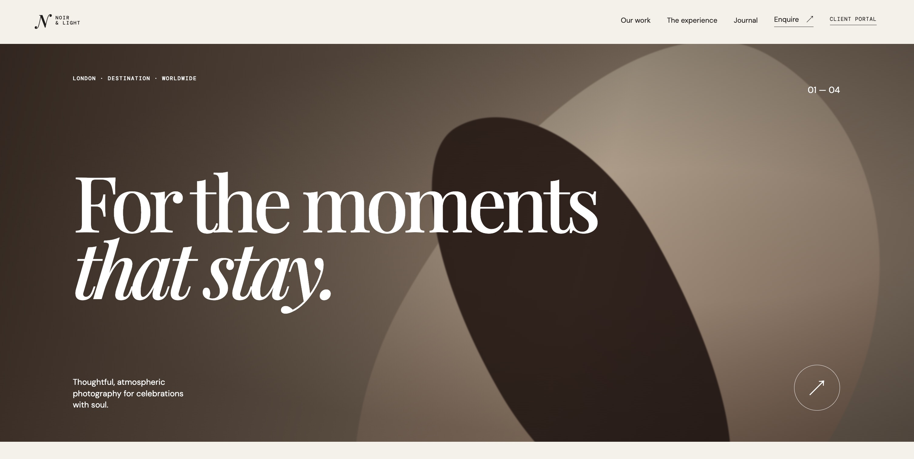
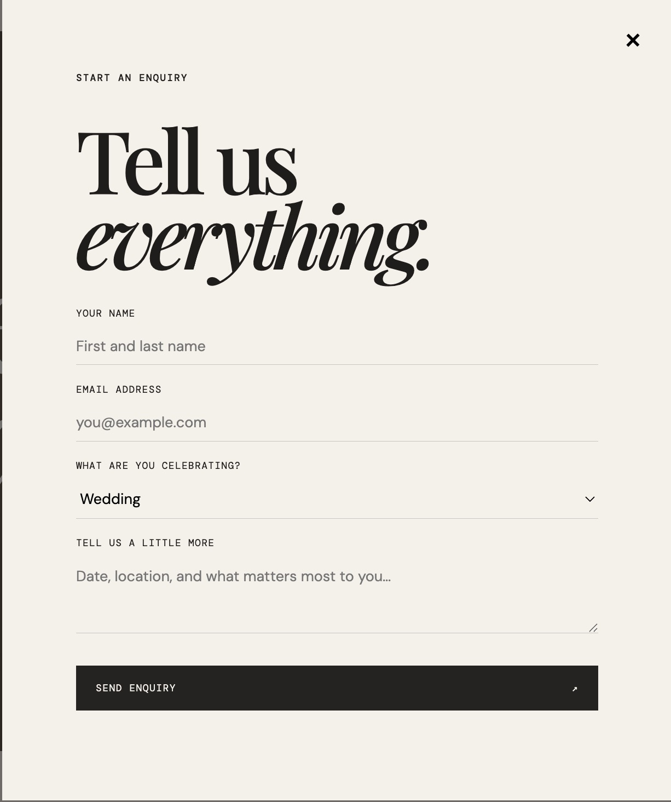
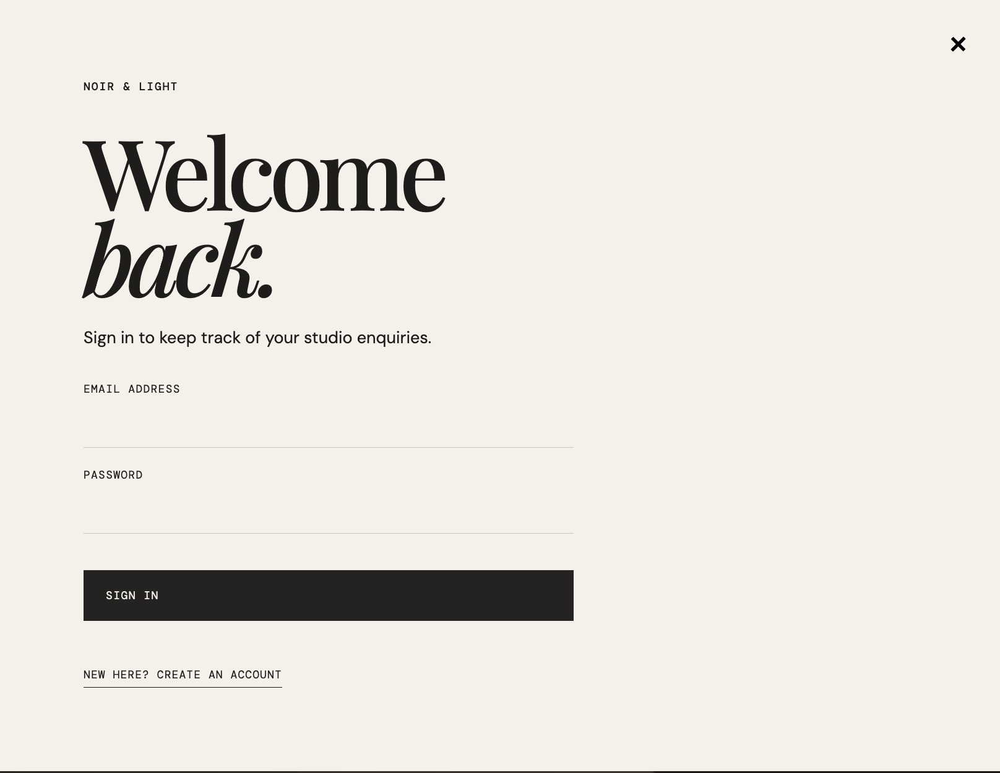

# Studio Portal

A photography studio booking and client management platform. Designed as a reusable template for any photography business — clients can submit inquiries about events (weddings, engagements, editorials, etc.) and track their bookings. Built with modern web technologies for a premium, responsive user experience.

## Screenshots







## Features

**Current**
- Responsive landing page with premium aesthetic
- Inquiry form with event type selection and details
- Client authentication portal
- Backend database for inquiry and booking management
- Real-time updates via Supabase

**Upcoming**
- Automated email confirmations
- Gallery and services showcase
- Booking calendar
- Invoicing and payments

## Tech Stack

- **Frontend**: React 19 + TypeScript
- **Build & Dev**: Vite 7
- **Backend / Database**: Supabase (PostgreSQL + Auth)
- **Styling**: CSS
- **Package Manager**: pnpm

## Getting Started

### Prerequisites
- Node.js 18+
- pnpm (or npm)
- A Supabase project

### Installation

1. **Clone and install**
```bash
git clone <your-repo-url>
cd studio-portal
pnpm install
```

2. **Set up environment**
```bash
cp .env.example .env.local
```

Then edit `.env.local` and add your Supabase credentials:
```env
VITE_SUPABASE_URL=https://your-project.supabase.co
VITE_SUPABASE_PUBLISHABLE_KEY=your-anon-key
```

3. **Initialize database** (one-time)
   - In Supabase Dashboard → **SQL Editor**, create a new query
   - Paste the contents of `supabase/schema.sql`
   - Click **Run**

4. **Start dev server**
```bash
pnpm dev
```

Open http://localhost:5173 in your browser.

### Available Scripts

- `pnpm dev` – Start Vite dev server
- `pnpm build` – Production build
- `pnpm preview` – Preview production build locally
- `pnpm lint` – Run ESLint

## Project Structure

```
src/
├── App.tsx           # Main app component & layout
├── Portal.tsx        # Client portal / auth flow
├── lib/
│   └── supabase.ts   # Supabase client & API
├── styles.css        # Global styles
└── main.tsx          # React root

supabase/
├── schema.sql        # Database schema & tables
└── migrations/       # Database migrations
```

## Customization

To adapt this template for your studio:
1. Update the branding in `App.tsx` and `styles.css`
2. Modify the inquiry form fields in `App.tsx` to match your services
3. Customize the event types dropdown in the form
4. Update database schema in `supabase/schema.sql` if needed

## Security Notes

- ⚠️ Never commit `.env.local` – it's in `.gitignore`
- Always use the **anon/publishable key** in the client (never service_role key)
- Environment variables are required for the app to run

## License

MIT
